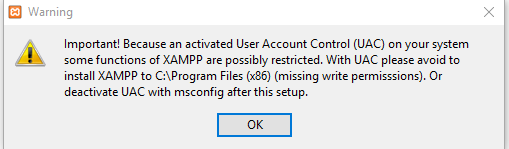
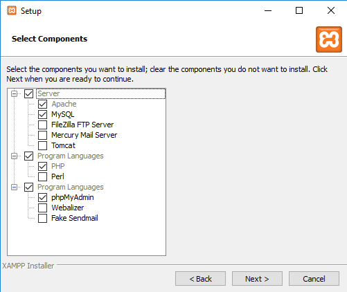
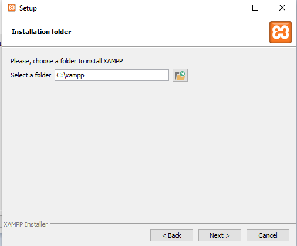

# Modul Basic PHP

# Apa itu PHP?

PHP adalah singkatan dari (`Hypertext Preprocessor`) yaitu sebuah bahasa pemrograman bersifat `open-source` yang secara khusus dibuat untuk keperluan pengembangan web dan juga bisa digabungkan dengan HTML. Namun PHP juga dapat memenuhi kebutuhan lain yang memerlukan scripting, Seperti perhitungan cepat, algoritma dan lainya.


## Apa yang bisa dilakukan PHP?

Apa pun. PHP utamanya berfokus pada pemrosesan sisi server, sehingga Anda dapat melakukan apa saja yang bisa dilakukan oleh program CGI lainnya, seperti mendapatkan data dari form, menghasilkan konten halaman yang dinamis, atau mengirim dan menerima cookie. Tetapi PHP dapat melakukan lebih banyak lagi.


### Tiga area utama yang dijangkau oleh PHP

- Pemrosesan pada sisi server. Ini adalah target utama dan paling tradisional untuk PHP. Namun Anda memerlukan tiga hal untuk membuatnya berfungsi: PHP Parser (modul CGI atau server), server web, dan browser web. Anda perlu menjalankan server web, dengan instalasi PHP yang terhubung. Anda dapat mengakses output program PHP dengan browser web, melihat halaman PHP melalui server. Semua ini dapat berjalan di mesin milik anda jika Anda hanya bereksperimen dengan pemrograman PHP. Lihat bagian instruksi instalasi untuk informasi lebih lanjut.
- Command Line Scripting. Anda dapat membuat skrip PHP untuk menjalankannya tanpa server atau browser apa pun. Anda hanya perlu parser PHP untuk menggunakannya dengan cara ini. Jenis penggunaan ini sangat ideal untuk skrip yang dieksekusi secara teratur menggunakan cron di (* nix atau Linux) atau Penjadwal Tugas (pada Windows). Skrip ini juga dapat digunakan untuk tugas pemrosesan teks sederhana. 
- Membuat aplikasi desktop. PHP mungkin bukan bahasa terbaik untuk membuat aplikasi desktop dengan user interface grafis yang indah, tetapi jika Anda mengenal PHP dengan baik, dan ingin menggunakan beberapa fitur cangih PHP di aplikasi sisi klien Anda, Anda juga dapat menggunakan PHP-GTK untuk tulis program semacam itu. Anda juga memiliki kemampuan untuk menulis aplikasi lintas platform dengan cara ini. Namun PHP-GTK adalah ekstensi dari PHP, tidak tersedia didistribusi utama. 

## Aturan menulis kode PHP

Menulis kode PHP memiliki beberapa aturan, Aturan-aturan ini digunakan dan diimplementasikan pada banyak situasi. Berikut ini beberapa aturan peulisan kode PHP.

### Basic syntax tag PHP

#### Menulis kode PHP murni

Menulis kode PHP murni bisa menggunakan 3 cara yaitu dengan.

1. Classic tag

   ```php
   <?php .... ?>
   ```
   Itu adalah tag paling basic dan universal yang digunakan untuk menulis kode php.

2. Open tag

   ```php
   <?= .... ?>
   ```

   Itu adalah tag alternatife yang digunakan dalam keadaan jika kode php butuh hanya 1 line saja, Artinya kode phpnya sangat simple dan pendek.


Sebenarnya ada dua tag lagi yang belum ditulis, Namun karena tag itu sudah tidak dapat digunakan pada versi PHP (7.x) saat penulis menulis ini, Maka tag tersebut tidak dimasukan.


Menulis tag pembuka php yang pertama `classic tag` biasanya digunakan saat kode php bercampur dengan HTML, atau bahasa pemrograman lainya. Namun jika kode php murni dijalankan tanpa ada campuran dari HTML atau bahasa pemrograman lainya, Maka penulisa kode php cukup seperti ini

```php
<?php 
    ...
    ...
    ...
```


Ditulis tanpa mengunakan penutup `?>` namun jika ingin digunakan penutup juga tidak masalah, Karena ini hanya standarisasi penulisan.

### Case Sensitivity dan Case Insensitive 

Apa itu Case Sensitivity yaitu penulisan huruf kapital atau huruf kecil diartikan sebagai sesuatu yang berbeda, Contohnya saat penulisan sebuah variable.

```php
<?php 
    $nama = "kucing";
    $Nama = "Kucing";
    $NAMA = "KUCING";
```

Penulisan nama berikut berbeda, Meskipun dibaca sama sama nama, Namun artinya berbeda. 


Apa itu Case Insensitive yaitu penulisan yang mengabaikan huruf kapital atau lainya, dan mengaggapnya sama. Beberapa contoh yaitu penulisan `echo`.

```php
<?php 
    echo "Kelinci";
    Echo "Kelinci";
    eCho "Kelinci";
    ECho "Kelinci";
```

Penulisan tersebut akan berarti sama karena memang beberapa fungsi di php mengabaikan case sensitive.


# Instalasi PHP pada komputer

Proses instalasi PHP pada komputer sangatlah sederhana dan mudah.  

## Untuk Windows

Pada platform windows banyak aplikasi yang bisa dipakai untuk instalasi PHP. Namun untuk kali kita akan menggunakan *xampp*, Karena selain paling populer juga sangat mudah.

1. Download xampp pada link ini [https://www.apachefriends.org/xampp-files/7.1.27/xampp-windows-x64-7.1.27-1-VC14-installer.exe](https://www.apachefriends.org/xampp-files/7.1.27/xampp-windows-x64-7.1.27-1-VC14-installer.exe)

2. Setelah selesai, Jalankan aplikasinya dan akan mendapatkan pesan seperti ini



klik ok saja.

3. Lalu lakukan koonfigurasi seperti ini.



4. Pilih folder instalasi, Sesuaikan default dengan menaruh pada folder `C:` 



5. Selesai itu tinggal next saja sampai selesai.


### Melakukan setting environment variable

Environment variable adalah setting untuk windows di mana mengenalkan windows dengan PHP nya, Supaya dapat dijalankan secara langsung pada Command Prompt

1. Buka Command Prompt (CMD) dengan as administrator

2. ketikan perintah berikut

   ```batch
   setx /M path "%path%;C:\xampp\php"
   ```

   Pastikan mendapat tulisan `SUCCESS: Specified value was saved.`

3. Tutup Command Promptnya 

4. Buka kembali dan tuliskan `php -v`  dan pastikan mendapatkan output yang mirip dengan ini.

   ```php
   PHP 7.2.6 (cli) (built: May 23 2018 20:51:04) ( ZTS MSVC15 (Visual C++ 2017) x86 )
   Copyright (c) 1997-2018 The PHP Group
   Zend Engine v3.2.0, Copyright (c) 1998-2018 Zend Technologies
   ```


### Menulis program pertamaku

Setelah melakukan instalasi, Mari kita menulis program php pertama kita, Tidak apa apa jika tidak mengerti kode apa yang kalian tulis berikut ini, Kita akan belajar setelah program pertama kalian sudah bisa dijalankan.


1. Pergi ke *Desktop* 
2. Buat sebuah file bernama `aku.php`
3. Buka file `aku.php` pada text editor kalian.
4. Lalu tuliskan kode berikut ini.

```php
<?php
    $nama = "Isi dengan nama kalian";
    echo "Halo dunia! Aku $nama siap untuk belajar PHP!";
```


5. Simpan text tersebut.
6. Lalu buka cmd dengan cara -> tekan logo windows + r
7. Lalu ketikan cmd
8. Akan terbuka sebuah command prompt 
9. Setelah itu ketikan `cd Desktop`
10. Lalu ketikan `php aku.php`
11. Lihat outputnya selamat belajar!


Setelah program pertama kalian sudah jadi. Mari kita belajar dengan detail.


## Mendefinisikan Variable

Variable adalah sebuah tempat untuk menyimpan berbagai tipe data. Dan datanya dapat diubah

### Tipe data

Tipe data adalah sebuah klasifikasi data menurut jenis data tertentu yang dikenal oleh suatu bahasa pemrograman. Berikut contoh tipe data yang dikenal oleh PHP.

| Nama   Tipe Data | Pengertian                                                   | Contoh                   |
| ---------------- | ------------------------------------------------------------ | ------------------------ |
| String           | Adalah semua karakter pada keyboard                          | AaBbCcDdEe!@#$%^&*_      |
| Integer          | Semua angka tanpa decimal                                    | 1000,10,1,2,34,5,77,1900 |
| Doubles          | Data yang memiliki titik atau bisa disebut desimal           | 10.1 , 100.222,   3.14   |
| Boolean          | Tipe data yang hanya memiliki isi True/False                 | False,True,true,false    |
| NULL             | Tipe data yang   menyatakan bahwa data itu tidak ada         | -                        |
| Array            | Sekumupulan data yang sejenis                                | ['sapi','kucing','kuda'] |
| Object           | Data pada pemrograman berbasis object                        | -                        |
| Resources        | Tipe data dari php saat melakukan handling pada file atau yang lainya | Koneksi DB               |

Namun untuk pengenalan basic PHP hanya beberapa tipe data yang digunakan yaitu, String,Integer,Double,Boolean,Array selainya tidak akan dipergunakan karena tidak begitu diperlukan.


### Aturan penulisan variable

1. Variable didefinisikan menggunakan `$` dollar sign.
2. Variable tidak boleh diawali dengan angka.
3. Variable boleh diawali dengan underscore `_` 
4. Variable boleh diawali dengan Huruf kapital atau Huruf kecil
5. Penulisan variable adalah case sensitive


```php
<?php
    $string = "Nikko Enggaliano";
    $integer = 17;
    $float  = 99.9;
    $boolean = true; 
    $boolean2 = false;
```


### Format isi variable

Penulisan isi variable juga mempunyai format, Sebagai berikut: 

1. Penulisan isi variable data (Integer / Double / Boolean) tidak menggunakan kutip.
2. Penulisan String menggunkan kutip dua (`"`) atau bisa juga dengan kutip satu (`'`) 
3. Perbedaan kutip satu dan kutip dua adalah, Jika menggunakan kutip satu, tidak bisa dengan menambahakan format `Escape sequance` 


Nilai variable dapat dirubah setelah didefinisikan, jadi nilainya tidak permanent seperti awal didefinisikan, penggunaannya perubahan variable contohnya seperti ini:


```php
<?php 
   	$nama = "Nikko Enggaliano";
	echo $nama; #Nikko Enggaliano
	$nama = "Im Nayeon";
	echo $nama; #Im Nayeon
```


Variable `$nama` awalnya berisi `Nikko Enggaliano` namun di bawahnya didefinisikan lagi variable `$nama` dengan isi `Im Nayeon` maka isi variable `$nama` yang sekarang adalah yang terbaru yaitu `Im Nayeon`.


#### Apa itu Escape sequance

Adalah sebuah urutan karakter yang tidak mewakili dirinya sendiri ketika digunakan atau bahkan mewakili arti lain. Penulisan Escape Sequance diawali dengan garis miring `\` dan dikuti dengan berbagai macam huruf atau angka untuk mewakili arti lain. Berikut ini beberapa contohnya yang sering kita jumpai.


| Escape   Sequence | Character   Represented |
| ----------------- | ----------------------- |
| \n                | New Line   |
| \r                | Carriage Return        |
| \t                | Horizontal Tab          |
| \v                | Vertical Tab            |
| \\\            | Backslash               |


## Mendefinisikan Constanta

Constanta adalah sebuah wadah untuk mendefinisikan suatu tipe data namun datanya tidak diubah lagi, nilainya akan permanent seperti awal didefinisikan. 

```php
<?php 
    define('buah', 'Jeruk');
	define('hewan', 'Kuda', True);
echo buah;
echo hewan;
echo HEWAN;
```


Constanta dapat dipanggil dengan Case Sensitivy maupun Insesitivy. Pendefinisian constanta mempunyai format.

`define(nama,isi,case)` 

`nama` diisi dengan definisi dari constantanya

`isi` disiis dengan isi constantanya

`case` boleh diisi maupun tidak, Jika diisi *True* maka menjadi Case Insensitive begitupun sebaliknya.


## Mendefinisikan Array

Array adalah suatu jenis tipe data yang bisa menyiman banyak data (baik dengan tipe data yang sejenis maupun berbeda) dalam satu wadah/variabel

```php
<?php 
    $array = [1,2,3,4,5,6];
    $array2 = array(1,2,3,4,5,6);
    $array3 = array('nama' => 'rotan','harga' => 1000);
	$array4 = ["sapi", 1000, True];
```


Aturan penulisan array bisa menggunkan `[]` atau dengan syntax `array()` diikuti dengan isi dari array tersebut. Array juga bisa mempunyai kunci untuk nilai yang akan didefinisikan. Contohnya pada `$array3` kita asumsikan `$array3` adalah sebuah detail kayu.

Mempunyai kunci yaitu `nama` dan berisi `rotan` selanjutnya mempunyai kunci `harga` dengan isi `1000` . Jika sejak awal tidak didefiniskan kunci dari anggota array itu maka automatis kuncinya akan dimulai dari `0` sampai `n` jumlah arraynya. Dengan contoh `$array` 


`$array` mempunyai anggota `[1,2,3,4,5,6]` maka kunci pertama dimulai dari `0` atau index ke `0` maka anggotanya adalah `1` maka bisa dipetakan seperti berikut.

0 -> 1

1 -> 2

2 -> 3

dst ..

Contoh berikutnya adalah `$array4` mempunyai isi atau anggota `["sapi", 1000, True]` maka bisa dipecah menurut kunci atau indexnya menjadi seperti berikut.

0 -> "sapi"

1 -> 1000

2 -> True 


Atau secara gampang bisa dengan rumus `n-1` di mana `n` adalah posisi sebenarnya dari urutan array.


## Membuat Output

Membuat output adalah cara kita menampilkan hasil dari program yang kita tulis pada bentuk visual. Ada 2 cara untuk menampilkan output pada bentuk visual pertama dengan syntax `echo` dan `print` seperti contoh berikut ini.

### Output pada variable biasa

```php
<?php 
    $nama = "Nikko Enggaliano\n";
    echo "Ini adalah sebuah output\n";
    echo $nama;
    echo "Halo nama saya ".$nama;
    print $nama;
    print "Haloo Dunia!";
```


Lalu apa perbedaanya? tidak ada hanya bentuk kebiasaan saja, Karena dibeberapa bahasa pemrograman lain menampilkan output menggunakan `print` namun umumnya pada php menggunakan `echo`.


Penggunaan `echo` dan `print` cukup sederhana seperti di atas. Bisa untuk membuat output dari sebuah variable atau langsung dengan string yang akan kita tampilkan.


### Output pada sebuah array

Membuat output pada array sangat berbeda dengan outpur pada variable biasa atau string langsung.

```php
<?php 
    $buah = ['Durian', 'Apel', 'Jeruk'];
    $hewan = array('Ikan', 'Kucing', 'Nyamuk');

    print_r($buah);
    print_r($hewan);
    print_r(array('nama' => 'Ikan', 'harga' => 1000));
```

Membuat output pada array menggunakan syntax `print_r` diikuti dengan variable berisi array atau langsung pada arraynya. 


### Menampilkan data pada sebuah array dengan menggunakan indeks

Jika menggunakan `print_r` kita mendapatkan semua data dari arraynya, Kita juga bisa mengeluarkan output hanya salah satu anggota dari array tersebut. 

```php
<?php 
    $buah = ['Durian', 'Apel', 'Jeruk'];
    $hewan = array('Ikan', 'Kucing', 'Nyamuk');
    $hewan2 = array('nama' => 'Ikan', 'harga' => 1000);
    
    echo $buah[1];
    echo $hewan[0];
    echo $hewan2['nama'];
```


Cara membuat output hanya anggota array dari variable tersebut dengan syntax `[key]` seperti contoh 

`echo $buah[1]` artinya adalah mengeluarkan output pada array `$buah` dengan index atau key `1`. Contoh berikutnya adalah `echo $hewan2['nama']`. Berarti pada array `$hewan2` dikeluarkan output yang mempunyai kunci `nama`.


### Input pada PHP Command Line

PHP CLI juga mendukung inputan pada user, Meski tidak sebaik bahasa pemrograman lain, PHP juga bisa membuat inputan CLI yang baik juga.


```php
<?php 

echo "Masukan sebuah input: ";
$ip = fgets(STDIN);
echo $ip;
```


Pada contoh di atas adalah inputan akan disimpan pada `$ip` namun inputan tersebut ketambahan sebuah Escape Sequeance lain yaitu `\n` artinya new line. Untuk menghilangkan `\n` kita menggunakan inputan dengan format seperti ini.


```php
<?php 

echo "Masukan sebuah input: ";
$ip = trim(fgets(STDIN));
echo $ip;
```


Kita bisa menghilangkan `\n` dengan syntax `trim`. 


## Built in Function

Built in Function adalah sebuah fungsi yang sudah ada dalam aplikasi atau bahasa pemrograman yang sudah disiapkan untuk end-user atau pemakainya guna mempermudah kebutuhan para penggunanya. Berikut ini ada beberapa contoh fungsi untuk memanipulasi string.


### Cara menggunakan Built in Function

`function()` terkadang kita cukup menulis fungsinya saja. Tapi ada beberapa fungsi yang memerlukan sebuah parameter. Apa itu parameter? Parameter adalah sebuah inputan untuk fungsi tersebut. Contohnya beberapa yang memerlukan parameter bentuknya akan seperti ini.

1. function()
2. function($param)
3. function($param1,$param2)


### Manipulasi String

#### strtolower
Fungsi ini digunakan untuk mengubah string inputan menjadi huruf kecil
```php
<?php
    $var = "Nikko Enggaliano";
    echo strtolower($var); #nikko enggaliano
    echo strtolower("Im Nayeon"); #im nayeon
```

#### strtoupper
Fungsi ini digunakan untuk mengubah string inputan menjadi huruf besar
```php
<?php
    $var = "Nikko Enggaliano";
    echo strtoupper($var); #NIKKO ENGGALIANO
    echo strtoupper("Im Nayeon"); #IM NAYEON
```

#### strlen
Fungsi ini digunakan untuk menghitung jumlah karakter dari string inputan
```php
<?php
    $var = "Nikko";
    echo strlen($var); #5
    echo strlen("Nikko Enggaliano"); #16
```

#### str_replace
Fungsi ini digunakan untuk melakukan penggantian karakter/kata pada string inputan
```php
<?php
    $var = "string saya";
    echo str_replace("saya","kamu",$var); #string kamu
```

Pada `str_replace` ini ada 3 parameter yang diperlukan. Bentuk umumnya akan seperti ini. `str_replace($param1,$param2,$param3);`  Penjelasannya adalah seperti ini.

*$param1* berisi `saya` parameter pertama ini adalah kata yang akan dicari.

$param2 berisi `kamu` parameter kedua ini adalah kata yang akan menganti paramter pertama.

$param3 berisi variable `$var` atau `string saya` paramter ketiga ini adalah sumber datanya atau variable atau stringnya.


#### str_repeat

Fungsi ini digunakan untuk mengulang karakter pada string inputan
```php
<?php
    $var = "php";
    echo str_repeat($var,5); #phpphpphpphpphp
```

`str_repeat` membutuhkan 2 paramter. 

Parameter pertama berisi dari variable atau stringnya.

Paramater kedua adalah jumlah kata yang ingin diulang dalam integer.

`str_repeat($var, 5)` artinya ingin mengulang variable `$var` sejumlah `5` kali.


### Return Value

#### rand

Fungsi *rand* adalah fungsi untuk mendapatkan nilai acak dari sebuah parameter minimum dan maximum atau tanpa parameter.

```php
<?php 
echo rand(); 
```

Jika fungsi rand tanpa parameter maka outputnya adalah sebuah angka acak dengan nilai yang tidak bisa terkontrol.

```php
<?php 
echo rand(1,100);
```

Jika fungsi rand dengan parameter min dan max maka, Nilai acaknya adalah mulai dari min sampai max. Dengan contoh itu, Maka angka acak outputnya antara 1 - 100.

#### date_default_timezone_set

Timezone pada php bisa diatur dengan fungsi `date_default_timezone_set` dengan 1 parameter yaitu. `Benua/IbuKota`. Dengan begini system php akan menyesuaikan dengan GMT daerah Jakarta.

```php
<?php 
date_default_timezone_set("Asia/Jakarta");
```

#### date

```php
<?php
date_default_timezone_set("Asia/Jakarta");
echo date("d - D - m - M - y - Y"); #22 - Thu - 07 - Jul - 21 - 2021
echo date("d:D"); #22:Thu
echo date("m:M"); #07:Jul
echo date("y:Y"); #21:2021
```

Program itu akan mengeluarkan output `Day-Month-Year` sesuai dengan timezone nya.

##  Stop Process

Kita dapat memaksa sebuah program berhenti secara paksa, Biasanya membuat berhenti secara paksa untuk proses `debuging` sebuah program, Yang tujuannya akan dijalankan baris perbaris ataupun sengaja diberhentikan untuk tujuan tertentu.

#### exit

```php
<?php
    exit;
```

Fungsi `exit` akan membuat program berhenti paksa tanpa ada pesan.

#### die

```php
<?php
    die('Program berhenti');
```

Fungsi `die` membuat proses berhenti secara paksa namun bisa dengan custom alert dengan parameter pertama dari `die`

## if dan else

Perbandingan / Percabangan dalam PHP hampir sama dengan semua perbandingan / percabangan dalam bahasa pemrograman lain. Perbadingan PHP juga mempunyai operator untuk prosesnya. Berikut ini daftarnya: 


| Operator | Artinya                    |
| -------- | -------------------------- |
| >        | Lebih Dari                 |
| <        | Kurang Dari                |
| ==       | Sama Dengan                |
| ===      | Sama Dengan Tipe   Datanya |
| >=       | Lebih Dari sama   Dengan   |
| <=       | Kurang Dari Sama   Dengan  |
| !=       | Tidak Sama Dengan.         |

Aturan dasar if else adalah seperti berikut.

```php
if(syarat){
    jika memenuhi syarat
}else{
    jika tidak memenuhi syarat
}
```

Percabangan tanpa `else` 

```php
if(syarat){
    syarat terpenuhi
}
```

Berikut ini contoh pengunaanya untuk membandingan nilai 2 variable.

```php
<?php
    $nilai1 = 100;
    $nilai2 = 1000;
    if($nilai1 > $nilai2){
        echo $nilai1." Lebih besar!";
    } else{
        echo $nilai2." Lebih besar!";
    }
```


Syarat dalam aturan tersebut adalah `$nilai1 > $nilai2`.  

Jika memenuhi bahwa `$nilai1` lebih besar dari `$nilai2` maka akan mengeluarka output bahwa `$nilai1` lebih besar. 

Jika tidak maka mengeluarkan output `$nilai2` lebih besar.


#### elseif

```php
<?php
    $nilai1 = 100;
    $nilai2 = 1000;
    if($nilai1 > $nilai2){
        echo $nilai1." Lebih besar!";
    } elseif($nilai1 == $nilai2){
        echo "Dua nilai sama besar!";
    } else{
        echo $nilai2." Lebih besar!";
    }
```


Elseif adalah sebuah perbandingan 2 syarat atau lebih. Seperti di atas contohnya. Syarat pertama adalah `$nilai1` lebih besar dari `$nilai2`. Syarat kedua adalah `$nilai1` sama besar dengan `$nilai2`.


### switch case

Switch case adalah pengecekan dengan syarat tanpa operator, Mirip dengan if else sama sama memiliki output yang berbeda jika tidak bisa memenuhi syarat.


#### Bentuk dasar switch case

```php
switch(syarat){

	case 'pilihan1':
		kode..
		break;

	case 'pilihan2':
		kode..
		break;
	default:
		kode..
		break;
        
}
```

Switch case mempunyai pilihan default jika tidak memenuhi syarat apapun.


```php
<?php 
    $buah = 'apel';
    switch($buah){
        case 'jeruk':
            echo 'Enak';
            break;
                case 'apel':
            echo 'Lezat';
            break;
        default:
            echo 'Hmmm';
            break;
    }
```

- Dalam kode itu, variable `$buah` berisi `apel` 
- Switch pada variable buah.
- Case pertama apakah `$buah` berisi `jeruk`  jika iya akan mengeluarkan output `Enak`
- Case kedua apakah `$buah` berisi `apel` jika iya akan mengeluarkan output `Lezat`
- Nilai defaultnya atau jika `case` tidak terpenuhi maka akan mengelurakan output `Hmmm`


## Looping

Looping atau perulangan di mana kode yang kita ingin ulang tidak perlu diketikan satu persatu. Ada beberapa teknik perluangan di bawah ini, Digunakan pada kondisi tertentu sesuai kebutuhan.


### For Loop

Foor loop merupakan bentuk looping yang memiliki 3 komponen yaitu.

- Awal
- Akhir
- Increment / Decrement


#### Bentuk dasar for loop yaitu.

```php
for(awal; akhir; i/decrement){
	kode..
}
```

Awal berisi dari angka berapa looping dimulai

Akhir berisi sampai angka berapa looping berhenti

in/decrement berisi looping itu maju atau mundur


```php
<?php 
    for($i=0; $i<10; $i++){
        echo $i;
    }
```

Looping di atas berawal dari 0 berakhir sampai kurang dari 10  dengan increment.


#### Reverse loop

```php
<?php
    for($i=100; $i>0; $i--){
        echo $i;
    }
```

Looping di atas berawal dari 100 sampai dengan lebih dari 0 dengan decrement, Yaitu looping mundur.


### For Each

Foreach adalah syntax looping untuk memecah sebuah array.

```php
<?php
    $buah = ['apel', 'jeruk', 'durian'];
    foreach($buah as $isi){
        echo $isi." ";
    }
```

Kode di atas bermaksud memecah array `$buah` kedalam variable `$isi` sekarang variable `$isi` berisi tiap-tiap element dari array `$buah`. 


#### Each with key

```php
<?php 
    $hewan = ['kucing', 'kelinci', 'kijang'];
    foreach($hewan as $key => $isi){
        echo $key."->".$isi." ";
    }
```

Kode di atas maksudnya adalah memecah array `$hewan` menjadi variable `$isi` dengan tambahan `$key` yaitu kunci dari element array tersebut, Karena tidak didefinisikan sebuah kunci dari array tersebut, Maka isi dari `$key` adalah urutan index mulai dari 0,1,2,N


### While

Berbeda dengan *for* loop perulangan while akan terus terjadi sampai koondisinya sudah terpenuhi.

```php
<?php 
    $count = 10;
    while($count < 100){
        echo $count;
        $count++;
    }
```

Seperti kode di atas syaratnya `$count` kurang dari 100. Sebelum memenuhi kurang dari 100 maka kode akan terus berjalan.


#### Reverse while

```php
<?php
    $count= 100;
    while($count > 5){
        echo $count;
        $count--;
    }
```

Sama seperti while sebelumya, Kode while di atas akan berjalan mundur.


### Do While

Perulangan yang terus terjadi selama kondisi yang ditentukan benar.

```php
<?php
    $count = 100;
    do{
        echo $count;
        $count--;
    }while($count > 10);
```

Kode di atas akan terus terulang sampai kondisi, `$count` bernilai lebih dari 10


### Custom function

Membuat fungsi kita sendiri. Selain ada *Built in Function* kita juga bisa membuat fungsi kita sendiri untuk mempermudah kebutuhan kita.

#### Aturan membuat fungsi

Membuat fungsi tanpa parameter.

```php
<?php 
    function namafungsi(){
   	kode.. 
}
```


Membuat fungsi dengan parameter, Paramater pada fungsi tidak terbatas berapa banyakpun.

```php
<?php 
    function namafungsi($param1){
    kode..
}

function namafungsi($param1,$param2){
    kode..
}
```


##### Penamaan fungsi

Sama seperti variable penamaan fungsi tidak bisa diawali dengan angka.

Penamaan fungsi memiliki kesaaman aturan dengan variable.


###### Fungsi tanpa output namun mereturn data

Fungsi tanpa output ini tidak menampilkan output pada saat fungsi dipanggil. Namun mengembalikan nilai yang dapat diolah lagi, atau yang nilai fungsinya dapat dimasukan ke dalam sebuah variable

```php
<?php
    function tambah($satu,$dua){
        return ($satu+$dua);
    }
	$hasil = tambah(100,100);
    echo tambah(10,10);

```

Seperti kode di atas membuat fungsi menghitung 2 inputan parameter berupa angka, Yang akan mengembalikan nilai hasil penjumlahan parameter tersebut, di mana data yang dikembalikan dapat diolah lagi menggunkan operasi lain atau operator lain.


###### Fungsi dengan output

Fungsi dengan output di mana hasil dari fungsi dapat langsung tampil, Tanpa harus meng`echo` terlebih dahulu. Namun data tidak dapat diolah kembali.

```php
<?php 
    function kurang($satu,$dua){
        echo ($satu-$dua);
    }
    kurang(100,125);
```


Seperti kode di atas, di mana fungsi kurang langsung menampilkan, hasil dari pengurangan 2 parameter inputan.


###### Fungsi dengan parameter default

Saat membuat fungsi, terkadang kita ingin memberikan nilai *default* pada suatu parameter berikut ini contohnya

```php
<?php 
    function SalamSapa($kondisi="pagi",$nama){
    	echo "Halo Selamat ".$kondisi." bagaimana harimu ".$nama;
	}

	SalamSapa("Nikko");
	SalamSapa("Malam", "Nikko");
```

Pada contoh di atas, fungsi `SalamSapa` sebenarnya ada 2 parameter pertama adalah `$kondisi` yang mana menerima kondisi keadaan bisa `pagi / siang / malam` yang kedua adalah `$nama` adalah nama seseorang yang ingin disapa. Namun di parameter `$kondisi` sudah ditetapkan yaitu nilainnya adalah `$kondisi="pagi"` yang mana jika parameter pertama tidak diisi maka nilai `$kondisi` sudah automatis terisi sebagai `pagi`. Namun jika ingin tetap mengisi maka konsepnya sama seperti yang sebelumnya.
